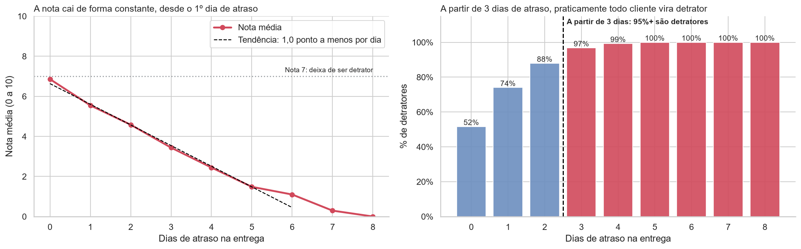

# NPS Preditivo: o que faz um cliente de e-commerce virar detrator?

**Tech Challenge · Fase 1 · Pós-Tech FIAP AI Scientist**

Análise de dados operacionais de um e-commerce (pedidos, logística e atendimento) para descobrir **quais fatores determinam a satisfação do cliente** e **como a empresa pode agir antes da pesquisa de NPS**.

| Entregável | Link |
|---|---|
| 📓 Notebooks (entendimento, preparação e EDA) | [`notebooks/`](notebooks/) |
| 📊 Slides (storytelling gerencial) | [`reports/slides/nps_preditivo_slides.pdf`](reports/slides/nps_preditivo_slides.pdf) |
| 🎥 Vídeo executivo (até 5 min) | 🚧 em produção |

---

## 1. Objetivo do projeto

A empresa cresceu rápido e passou a ter alta variação de satisfação entre clientes. Hoje o NPS só é coletado **depois** do fim da jornada de compra, quando já não dá para corrigir a experiência.

**Pergunta orientadora:**
> Quais fatores operacionais realmente influenciam a satisfação do cliente e como a empresa pode agir de forma proativa, antes mesmo da aplicação da pesquisa de NPS?

O foco é **entendimento do problema, pensamento analítico e storytelling com dados**: traduzir os dados em recomendações claras para Logística, Atendimento, CX e Estratégia.

## 2. Principais resultados

| | Achado |
|---|---|
| 🚨 **Retrato** | NPS de **−80**: 84% dos clientes são detratores e só 4% são promotores. |
| 🚚 **Fator nº 1** | **Atraso na entrega.** Sem atraso: 52% de detratores. Com 3+ dias: **97–100%**. |
| ⏱️ **Ponto de ruptura** | **A nota cai ~1 ponto por dia de atraso, desde o 1º dia.** A partir do **3º dia**, 97%+ já são detratores. A ação precisa começar no 1º dia. |
| 📐 **Quanto pesa cada um** | Os 4 fatores juntos explicam **56%** da variação da nota. Cada dia de atraso custa 1 ponto; cada reclamação, 0,4; cada contato a mais, 0,3. |
| 📦 **Prazo ≠ atraso** | O prazo prometido de entrega **não** afeta a nota. O que pesa é **quebrar a promessa**. |
| 📞 **Atendimento** | Reclamações e contatos repetidos derrubam a nota: 3+ contatos = 95% de detratores. |
| 👥 **Perfil do cliente** | Região, idade, tempo de casa e valor do pedido **não** mudam o NPS (todos ≈ −80). |
| ✅ **Jornada perfeita** | Sem atraso e sem problemas no atendimento, a nota média é **8,1** e o NPS fica em torno de **+9**. Mas só 3% dos clientes (77) têm essa experiência, e com tão poucos o NPS pode estar entre −8 e +27. |
| 🔍 **Dado suspeito** | A coluna de recompra é **exatamente `nps_score >= 8`** em 100% dos pedidos: foi derivada da nota. Por isso **não** é usada como evidência de impacto financeiro. |

<p align="center">
  
</p>

**Mensagem central:** a insatisfação não vem de *quem* é o cliente, mas do *que acontece* com o pedido dele. É um problema **gerenciável pela operação**: cumprir o prazo prometido e resolver o problema no primeiro contato.

## 3. Base de dados

- **Arquivo:** `data/raw/desafio_nps_fase_1.csv` ([fonte original](https://github.com/AnaRaquelCafe/POSTECH_AI_SCIENTIST/blob/main/Base%20de%20dados%20Tech%20Challenge/desafio_nps_fase_1.csv))
- **Tamanho:** 2.500 pedidos × 19 colunas, sem valores nulos nem duplicados, 1 pedido por cliente

| Grupo | Coluna | Descrição |
|---|---|---|
| Identificação | `customer_id`, `order_id` | Identificadores do cliente e do pedido |
| Perfil | `customer_age` | Idade do cliente |
| | `customer_region` | Região geográfica |
| | `customer_tenure_months` | Tempo de relacionamento com a empresa (meses) |
| Pedido | `order_value` | Valor total do pedido |
| | `items_quantity` | Quantidade de itens |
| | `discount_value` | Valor de desconto aplicado |
| | `payment_installments` | Número de parcelas |
| Logística | `delivery_time_days` | Prazo previsto de entrega (dias). O dicionário diz "tempo total"; ver "Problema 1" abaixo |
| | `delivery_delay_days` | Dias de atraso em relação ao prazo previsto |
| | `freight_value` | Valor do frete |
| | `delivery_attempts` | Tentativas de entrega |
| Atendimento | `customer_service_contacts` | Contatos com o atendimento |
| | `resolution_time_days` | Tempo para resolução de problemas (dias) |
| | `complaints_count` | Reclamações registradas |
| Pós-compra* | `repeat_purchase_30d` | Recompra em até 30 dias (0/1) |
| | `csat_internal_score` | Score interno de satisfação |
| **Alvo** | `nps_score` | Nota de NPS (0 a 10), coletada após a experiência de compra |

\* Medidos **junto ou depois** do NPS. Não são usados como fatores explicativos, para evitar *data leakage* (vazamento de informação). Além disso, `repeat_purchase_30d` é uma **função exata da nota** (`nps_score >= 8` em 2.500 de 2.500 pedidos), o que indica base sintética; ver "Problema 3" abaixo.

## 4. Metodologia

O projeto segue o **CRISP-DM**. Cada fase corresponde a um notebook:

| Fase CRISP-DM | Onde está | O que faz |
|---|---|---|
| 1. Entendimento do Negócio | [`01_entendimento_negocio`](notebooks/01_entendimento_negocio.ipynb) | Problema de negócio, importância do NPS, áreas beneficiadas, impacto em recompra, boca a boca e market share, definição da target e seus riscos |
| 2. Entendimento dos Dados + 3. Preparação | [`02_preparacao_dados`](notebooks/02_preparacao_dados.ipynb) | Qualidade dos dados, teste das regras do dicionário, tratamento de inconsistências, outliers, regra de classificação do NPS e variáveis derivadas |
| 2. Entendimento dos Dados (EDA) | [`03_eda`](notebooks/03_eda.ipynb) | Responde às 4 perguntas de negócio, com gráficos e textos voltados a gestores não técnicos, mais uma regressão múltipla e testes estatísticos para sustentar as conclusões |
| 4. Modelagem | Seção 6 do [`03_eda`](notebooks/03_eda.ipynb) | Reflexão sobre o modelo preditivo (desafio opcional 4, não implementado): classificação de detrator, variáveis sem vazamento, separação, modelo, avaliação contra o chute trivial e uso em dois momentos da jornada |
| 5. Avaliação + 6. Implantação | Final do [`03_eda`](notebooks/03_eda.ipynb) | Confronta as metas analíticas do notebook 01 com os resultados e propõe gatilhos operacionais (alerta no 1º dia de atraso, fila prioritária no SAC) com métricas de acompanhamento |

### Principais decisões de tratamento

| Decisão | Justificativa |
|---|---|
| **Classificação do NPS por corte direto** (Detrator < 7 ≤ Neutro < 9 ≤ Promotor) | As notas têm casas decimais. Um 6,8 não chegou a 7. A alternativa de arredondar foi testada (NPS −74 contra −80) e a conclusão não muda. |
| **`delivery_time_days` lido como prazo previsto**, nenhum valor alterado | Em 121 pedidos o atraso é maior que o "tempo total" do dicionário. Os dados e o professor confirmam que a coluna é o prazo previsto, e o atraso é contado a partir dele: não há erro. A leitura literal, com imputação, foi feita como teste de sensibilidade e leva às mesmas conclusões. Detalhes abaixo. |
| **Desconto > valor do pedido** (35 pedidos) mantido | Faz sentido se o valor do pedido for líquido. Detalhes abaixo. |
| **Outliers mantidos** | São casos reais (atrasos longos, muitos contatos) e justamente os mais relevantes para entender detratores. |
| **CSAT e recompra fora dos fatores explicativos** | Evita *leakage*: essas informações não existem antes da pesquisa de NPS. |
| **Recompra não usada nem como evidência** | A coluna é `nps_score >= 8` em 100% dos pedidos (derivada da nota). Qualquer "prova" de que detrator não recompra seria verdadeira por construção. |
| **Nenhuma coluna corrige outra** | A regra de consistência lógica entre as colunas de atendimento não vale (há mais reclamações do que contatos em 97% dos pedidos). As análises conjuntas (mapa de calor, regressão) usam a distribuição como está, com essa ressalva. |

### Dados inconsistentes: o que encontramos e como tratamos

A base **não tem valores nulos nem linhas duplicadas**. O problema encontrado é outro: **valores que existem, mas são logicamente impossíveis** quando comparamos uma coluna com outra.

#### Problema 1: atraso maior que o "tempo total" de entrega (121 pedidos, 4,8% da base): ambiguidade do dicionário, não erro

**O que parecia errado:** o dicionário de dados descreve `delivery_time_days` como **tempo total** de entrega e `delivery_delay_days` como **dias de atraso**. Nessa leitura literal, o atraso seria uma **parte** do tempo total e nunca poderia ser maior que ele. Mesmo assim, há 121 pedidos assim:

| order_id | `delivery_time_days` | Dias de atraso | Na leitura literal |
|---|---|---|---|
| 50006 | 4 dias | 5 dias | A entrega levou 4 dias no total, mas atrasou 5? |
| 50047 | 4 dias | 6 dias | Atraso 2 dias maior que a entrega inteira |
| 50042 | 2 dias | 3 dias | Idem |

**Erro ou leitura errada?** Antes de tratar, testamos o dicionário contra os dados. Existe uma segunda leitura: `delivery_time_days` = **prazo previsto** e `delivery_delay_days` = atraso **em relação a esse prazo**, com entrega real = prazo + atraso. Os dados favorecem essa leitura:

- Prazo e atraso são **independentes** (correlação −0,007; atraso médio de ~2,2 dias em todo prazo, de 2 a 14 dias). Se o atraso fosse parte do tempo total, prazos curtos teriam atrasos menores.
- Na leitura literal, além dos 121 casos, outros 146 pedidos teriam "prazo prometido" de **zero dias**. Na leitura de prazo previsto, **nenhum** valor é impossível (entregas reais de 2 a 22 dias).

**Confirmação do professor:** a mesma dúvida foi levada ao fórum do curso, e o Prof. Ariel Velardo esclareceu (05/10/2026) que `delivery_time_days` pode ser lido como o **prazo estimado** e `delivery_delay_days` como o atraso em relação a ele, e que a descrição "tempo total de entrega" ficou ambígua no dicionário.

**Decisão:** adotamos a leitura de **prazo previsto**. **Nenhum valor foi alterado** e as 2.500 linhas entram em todas as análises. Criamos `tempo_real_entrega_dias` (prazo + atraso), o tempo que o cliente de fato esperou.

**Teste de sensibilidade (e se a leitura literal estivesse certa?):** nesse caso, os 121 valores seriam impossíveis. Excluir as linhas descartaria justamente o grupo mais insatisfeito (nota média **2,3** contra **4,5**), então a saída seria **imputar** só a célula errada. A regressão linear para estimar o valor foi testada e descartada (R² de **0,017**), e a imputação seria pela **mediana** (8 dias). Refizemos a análise com essa base imputada: o prazo continua sem relação com a nota (correlação entre −0,07 e 0,00 nas três versões) e a coluna de atraso não muda. **Nenhuma conclusão depende da leitura.** O passo a passo está nas seções 5.1 e 5.2 do notebook 02.

#### Problema 2: desconto maior que o valor do pedido (35 pedidos, 1,4% da base)

**O que parece errado:** no pedido 50007, o valor é **R$ 41,29** e o desconto é **R$ 99,62**. Se `order_value` fosse o preço cheio, o desconto seria maior que o próprio produto, o que é impossível.

**Por que mantivemos:** existe uma leitura em que tudo faz sentido. Se `order_value` é o valor **já com o desconto aplicado** (o que o cliente efetivamente pagou), o preço cheio era R$ 41,29 + R$ 99,62 = **R$ 140,91**, e o desconto foi de 71%. Com essa interpretação, os 35 casos ficam coerentes e **nenhum valor precisa ser alterado**. O % de desconto passa a ser calculado sobre o valor bruto (`order_value + discount_value`), e as linhas ficam marcadas com `flag_inconsistencia_desconto`.

#### Problema 3: a recompra é uma função exata da nota

Antes de usar `repeat_purchase_30d` para mostrar que "detrator não recompra", testamos a coluna: ela é **exatamente `nps_score >= 8` em 2.500 de 2.500 pedidos** (menor nota de quem recomprou: 8,0; maior nota de quem não recomprou: 7,9). Dado real de comportamento nunca é assim. A coluna foi **derivada da própria nota**, e qualquer relação encontrada seria verdadeira por construção. Decisão: a recompra **não é usada como evidência**; o argumento de que satisfação gera recompra fica apoiado na literatura (Reichheld, 2003), e a recomendação é medir a recompra real nos próximos ciclos.

#### Problema 4: relações entre colunas de atendimento

Em **97% dos pedidos** há mais reclamações do que contatos com o atendimento, e em 20% há tempo de resolução sem nenhum contato. Ou "reclamação" é algo que não passa pelo SAC (ex.: avaliação pública), ou a base foi gerada coluna a coluna. Decisão: **não tratar**, não usar nenhuma coluna para corrigir ou derivar outra, e registrar como limitação.

O passo a passo completo, com o código, está nas seções 5 e 9 do notebook [`02_preparacao_dados`](notebooks/02_preparacao_dados.ipynb).

### Limitações

- A análise mostra **associação, não causalidade**. O ideal é validar as recomendações com testes controlados.
- A base não tem datas: não é possível analisar sazonalidade nem a evolução no tempo.
- A base tem fortes sinais de ser **sintética**: notas com decimais, pico de notas em zero (efeito de piso), mais reclamações do que contatos e recompra derivada da nota. Nem todas as **regras de consistência lógica entre colunas** valem; nenhuma coluna foi usada para corrigir outra, e as análises conjuntas devem ser lidas com essa ressalva.
- A **jornada perfeita** tem só 77 clientes: o NPS desse grupo (+9) tem intervalo de confiança de −8 a +27. O sinal ("outro patamar") é claro; o número exato não é.
- O modelo preditivo (desafio opcional 4) **não foi implementado**; a estratégia está descrita na seção 6 do notebook 03.

## 5. Estrutura do repositório

```
├── data/
│   ├── raw/                  # base original (nunca alterada)
│   └── processed/            # base tratada, gerada pelo notebook 02
├── notebooks/
│   ├── 01_entendimento_negocio.ipynb
│   ├── 02_preparacao_dados.ipynb
│   └── 03_eda.ipynb
├── src/
│   ├── __init__.py
│   └── preparacao.py         # carga, classificação do NPS, faixas, regressão e bootstrap (fonte única)
├── reports/
│   ├── figures/              # gráficos gerados pelos notebooks (usados nos slides)
│   └── slides/               # apresentação para público não técnico (PDF)
├── .gitattributes            # fim de linha LF e arquivos binários, igual em qualquer sistema
├── .gitignore                # exclui .venv, caches e material do curso
├── requirements.txt          # dependências para rodar a análise
├── requirements-dev.txt      # ferramentas de qualidade de código (Black, Flake8, pre-commit)
├── pyproject.toml            # configuração do Black
├── .flake8                   # configuração do Flake8
├── .pre-commit-config.yaml   # verificações automáticas a cada commit
└── README.md
```

A estrutura é inspirada no template [Cookiecutter Data Science](https://cookiecutter-data-science.drivendata.org/): dados brutos separados dos tratados, notebooks numerados na ordem de execução e código reaproveitável em `src/`. A pasta `data/processed/` é um artefato: é regenerada pelo notebook 02 e está versionada só para permitir abrir o notebook 03 direto.

## 6. Como reproduzir

**Pré-requisito:** Python **3.11+**

```bash
# 1. Clonar o repositório
git clone https://github.com/CristovaoTorres/techchallenge-fase1-nps.git
cd techchallenge-fase1-nps

# (Windows: clone numa pasta de caminho curto, ex. C:\projetos, ou habilite "Long Paths".
#  Uma dependência do Jupyter tem arquivos com nomes longos e o pip pode falhar.)

# 2. Criar e ativar um ambiente virtual
python -m venv .venv
.venv\Scripts\activate        # Windows
# source .venv/bin/activate   # Linux / macOS

# 3. Instalar as dependências
pip install -r requirements.txt

# 4. Abrir os notebooks
jupyter notebook
```

Leia o notebook `01` (só texto) e execute **na ordem** `02 → 03`. O notebook `02` gera `data/processed/nps_tratado.csv`, que é lido pelo `03`. Todos os gráficos são salvos automaticamente em `reports/figures/`. A única etapa aleatória (bootstrap do intervalo de confiança) tem semente fixa: executar de novo gera exatamente os mesmos arquivos.

Para rodar tudo de uma vez pela linha de comando:

```bash
cd notebooks
jupyter nbconvert --to notebook --execute --inplace 02_preparacao_dados.ipynb 03_eda.ipynb
```

O `--inplace` reescreve os notebooks com as saídas novas (o `git status` vai mostrá-los modificados, só por causa dos carimbos de tempo de execução). Para não tocar nos arquivos originais, troque por `--output-dir ../reports/`.

## 7. Boas práticas de código

Além de funcionar, o código precisa ser fácil de ler, revisar e reproduzir por outra pessoa. Para isso, o projeto usa as ferramentas abaixo:

| Ferramenta | O que faz | Por que usamos |
|---|---|---|
| **venv** + `requirements.txt` | Ambiente virtual isolado com versões fixas das bibliotecas principais | Qualquer pessoa instala as mesmas versões de pandas, numpy, matplotlib, seaborn e scipy e obtém os mesmos resultados |
| **[Black](https://black.readthedocs.io/)** | Formata o código automaticamente (scripts **e notebooks**) | Padroniza o estilo sem discussão manual: o código fica igual, não importa quem escreveu |
| **[Flake8](https://flake8.pycqa.org/)** + **[nbQA](https://nbqa.readthedocs.io/)** | Verifica o código contra a **PEP 8** e aponta erros como variáveis não definidas e imports não usados | Encontra problemas antes de rodar. O nbQA permite aplicar o Flake8 também nos notebooks |
| **[pre-commit](https://pre-commit.com/)** | Roda Black, Flake8 e verificações básicas (espaços sobrando, arquivos grandes) **a cada `git commit`** | Garante que nenhum código fora do padrão entre no repositório |
| **Docstrings** e comentários | Toda função em `src/` tem docstring com `Args` e `Returns`. Os comentários explicam o *porquê* das decisões, e todo limiar usado nos gráficos é uma constante nomeada com o motivo ao lado | Quem lê entende a intenção, não só o que o código faz |
| **Fonte única de verdade** | Faixas, limiares de jornada e caminhos ficam em `src/preparacao.py`, importados pelos notebooks | Um rótulo alterado em um lugar só não quebra silenciosamente o outro |

Principais escolhas de configuração:
- **Linhas de até 100 caracteres** (em vez dos 79 da PEP 8): com nomes de variáveis em português, claros e descritivos, 79 caracteres quebrariam o código demais. Black e Flake8 usam o mesmo limite.
- **E203 e E701 ignorados no Flake8**: são as regras que conflitam com a formatação do Black (recomendação da documentação do Black).
- **`# noqa: E402` nos notebooks**: o `import` de `src/` precisa vir depois de adicionar a raiz do projeto ao `sys.path`. A exceção está marcada e justificada no código.

Para usar as ferramentas:

```bash
pip install -r requirements-dev.txt
pre-commit install            # ativa as verificações a cada commit
pre-commit run --all-files    # roda tudo manualmente
```

## 8. Autores

| Nome | RM |
|---|---|
| Cristóvão Torres | *(preencher)* |
